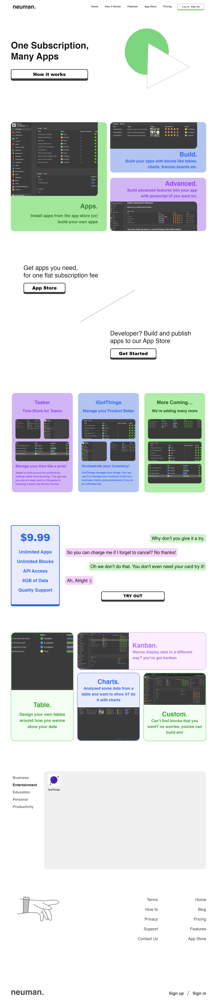

### `Neuman 2.0 - minimalistic version of-` [NEUMAN](http://neuman.iftikharrasha.com).

<p align="center">
  <a href="https://iftikharrasha.github.io/neuman-minimalistic/">
    
  </a>
</p>

<h1 align="center">Neuman 2.0</h1>

<p align="center">
  Design and prototyping using Adobe XD and built using HTML - SCSS - bootstrap, JS - Jquery. Hosted on github pages!
</p>



## 🚀 Installation

1.  Clone the repository and change directories

    ```shell
    git clone https://github.com/iftikharrasha/neuman-minimalistic.git
    cd neuman-minimalistic
    ```

2. Click index.html or Start the local server

    The site is now running at `http://127.0.0.1:5500/`!
    

3.  **Open the source code and start editing!**
 
 ## 🎨 Color Reference
| Color          | Hex                                                                |
| -------------- | ------------------------------------------------------------------ |
| White        |  `#FFFFFF` |
| litegreen         |  `#B0EDA9` |
| Green        |  `#3B9B31` |
| darkgreen         |  `#165D13` |
| Liteblue      |  `#E8EDFF` |
| Blue       |  `#3268FC` |
| Pink    |  `#F6D1FF` |
| Black        |  `#000000` |